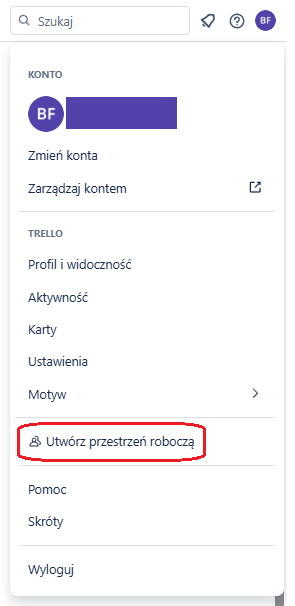
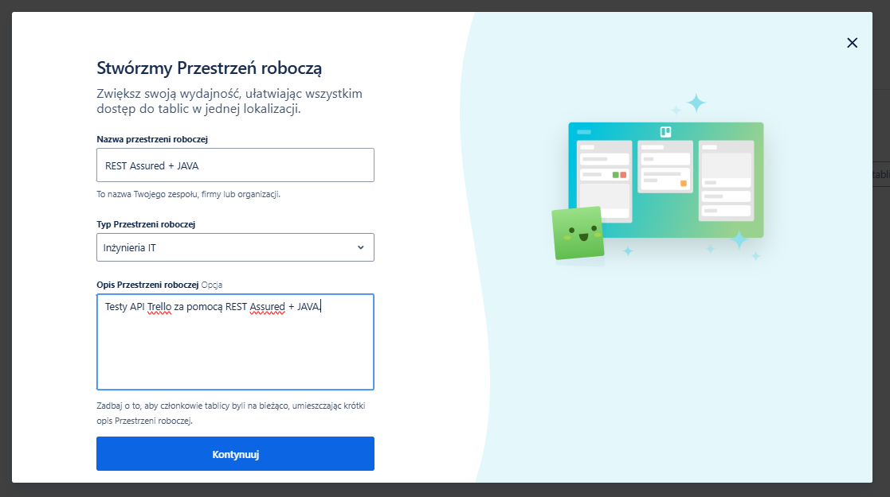
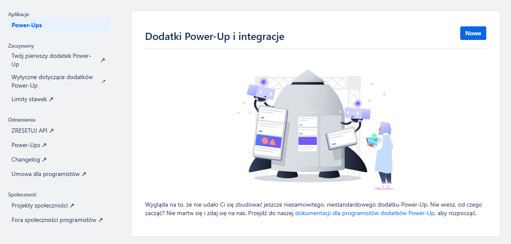
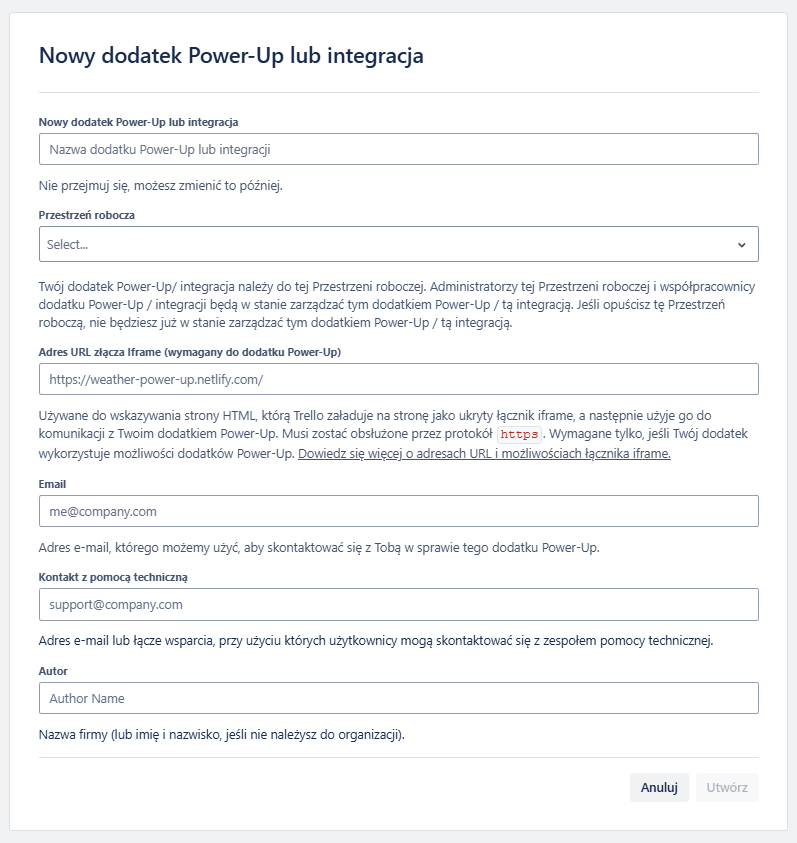

# 🔼Trello – konfiguracja

1. Zakładamy konto na stronie `Trello`:  
   https://trello.com/
2. Zakładamy konto na `Trello Developers`:  
   (UWAGA: Teraz chyba powinno działać na tym nasze pierwsze konto)  
   https://developer.atlassian.com/cloud/trello/
3. Na naszym koncie tworzymy `Przestrzeń roboczą (Workspace)`:
   - W prawym, górnym rogu klikamy na `ikonkę naszego profilu`
   - Klikamy `Utwórz przestrzeń roboczą`  
     
   - Wypełniamy pola poniższego formularza:  
     
     - Podajemy jej `nazwę`
     - Wybieramy jej `typ`
     - Podajemy jej `opis`
     - Klikamy przycisk `Kontynuuj`
4. Na poniższej stronie zapoznajemy się z informacjami z sekcji **Managing your API Key**:  
   https://developer.atlassian.com/cloud/trello/guides/rest-api/api-introduction/
5. Tworzymy **Trello Power-Up**:
   - Wchodzimy na poniższą stronę i zaczynamy zapoznawać się z informacjami:  
     https://developer.atlassian.com/cloud/trello/guides/power-ups/managing-power-ups/#adding-a-new-custom-power-up
   - Zarządzanie `Power-Up'ami` odbywa się za pośrednictwem strony:  
     https://trello.com/power-ups/admin  
     
     - Klikamy przycisk `Nowe`
   - Wypełniamy pola poniższego formularza:  
     
     - Podajemy `nazwę dodatku`
     - Wybieramy `przestrzeń roboczą`
     - Podajemy `adres URL` (może być byle jaki)
     - Podajemy `email` (może być nasz)
     - Podajemy `email pomocy technicznej` (może być nasz)
     - Podajemy `autora` (możemy być my)
     - Klikamy przycisk `Utwórz`