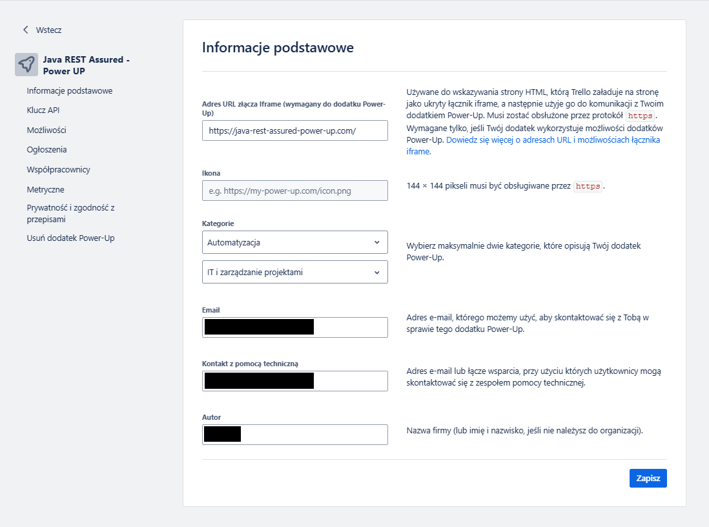
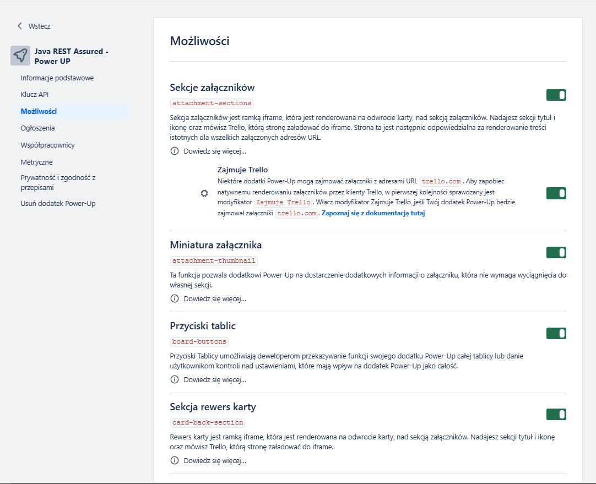
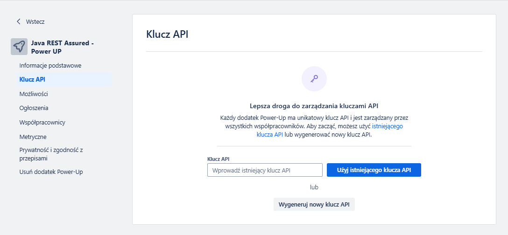
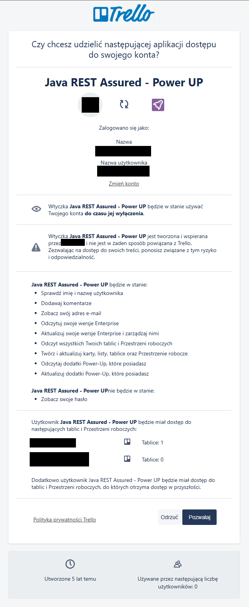
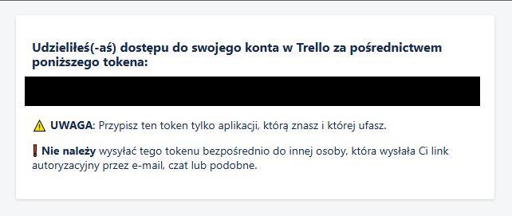

# 🔼Trello – konfiguracja

1. Zakładamy konto na stronie `Trello`:  
   https://trello.com/
2. Zakładamy konto na `Trello Developers`:  
   (UWAGA: Teraz chyba powinno działać na tym nasze pierwsze konto)  
   https://developer.atlassian.com/cloud/trello/
3. Na naszym koncie tworzymy `Przestrzeń roboczą (Workspace)`:
   - W prawym, górnym rogu klikamy na `ikonkę naszego profilu`
   - Klikamy `Utwórz przestrzeń roboczą`  
     
   - Wypełniamy pola poniższego formularza:  
     
     - Podajemy jej `nazwę`
     - Wybieramy jej `typ`
     - Podajemy jej `opis`
     - Klikamy przycisk `Kontynuuj`
4. Na poniższej stronie zapoznajemy się z informacjami z sekcji **Managing your API Key**:  
   https://developer.atlassian.com/cloud/trello/guides/rest-api/api-introduction/
5. Tworzymy `Trello Power-Up`:
   - Wchodzimy na poniższą stronę i zaczynamy zapoznawać się z informacjami:  
     https://developer.atlassian.com/cloud/trello/guides/power-ups/managing-power-ups/#adding-a-new-custom-power-up
   - Zarządzanie `Power-Up'ami` odbywa się za pośrednictwem strony:  
     https://trello.com/power-ups/admin  
     
     - Klikamy przycisk `Nowe`
   - Wypełniamy pola poniższego formularza:  
     
     - Podajemy `nazwę dodatku`
     - Wybieramy `przestrzeń roboczą`
     - Podajemy `adres URL` (może być byle jaki)
     - Podajemy `email` (może być nasz)
     - Podajemy `email pomocy technicznej` (może być nasz)
     - Podajemy `autora` (możemy być my)
     - Klikamy przycisk `Utwórz`
6. Po udanym stworzeniu `Power UP'a` zostaniemy przeniesieni na stronę z `Podstawowymi informacjami`.  
   
   Opcjonalnie możemy wybrać kategorie:
    - Główną: `Automatyzacja`
    - Dodatkową: `IT i zarządzanie projektami`
    - Klikamy przycisk `Zapisz`
7. W menu po lewej klikamy `Możliwości` i **włączamy** wszystkie `opcje`  
   (Wydaje mi się, że umożliwi to pisanie testów pod większą ilość endpoint'ów)  
   
8. W menu po lewej klikamy `Klucz API` i **generujemy nowy klucz API** lub **używamy istniejącego klucza API**  
   
9. Gdy to się uda zostanie otwarta strona z `kluczem API` oraz `Sekretem`  
   
   - Kopiujemy/Zapisujemy gdzieś `Klucz API`
   - Kopiujemy/Zapisujemy gdzieś `Sekret`
10. Po prawej od `Klucz API` klikamy hiperłącze w słowie `token`
11. Zostaniemy przeniesieni do strony z podsumowaniem i klikamy przycisk `Pozwalaj`  
    
12. Zostaniemy przeniesieni na stronę, na której będzie wyświetlony nasz `token`.  
    Kopiujemy/Zapisujemy go.  
    
13. Możemy rozpocząć pisanie `pierwszych requestów do API`

# 🧭Dalsze kroki — rozpoczęcie pisania testów 

Dalsze kroki opisujące jak rozpocząć pisanie testów znajdują się w:  
📁rest-assured-java-api (projekt)  
&emsp;📁documents  
&emsp;&emsp;📁notes  
&emsp;&emsp;&emsp;📂rest-assured-and-tests